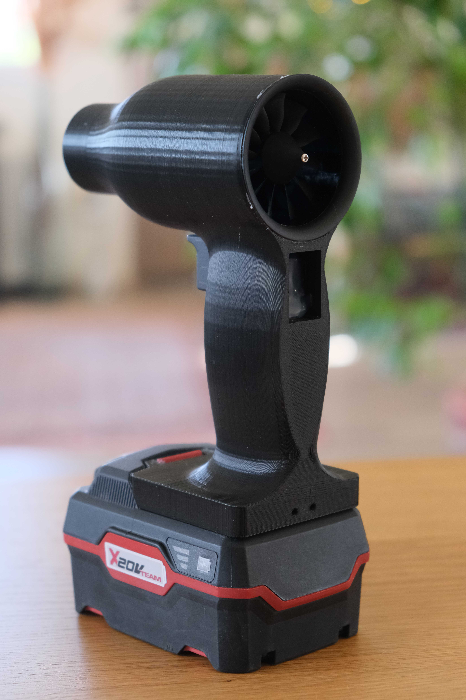
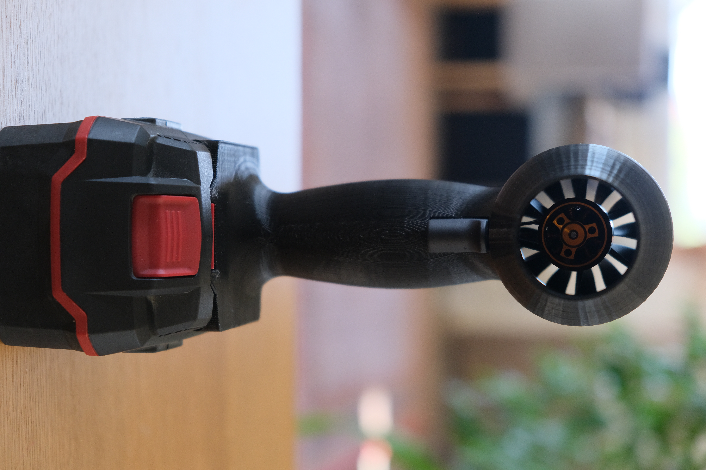
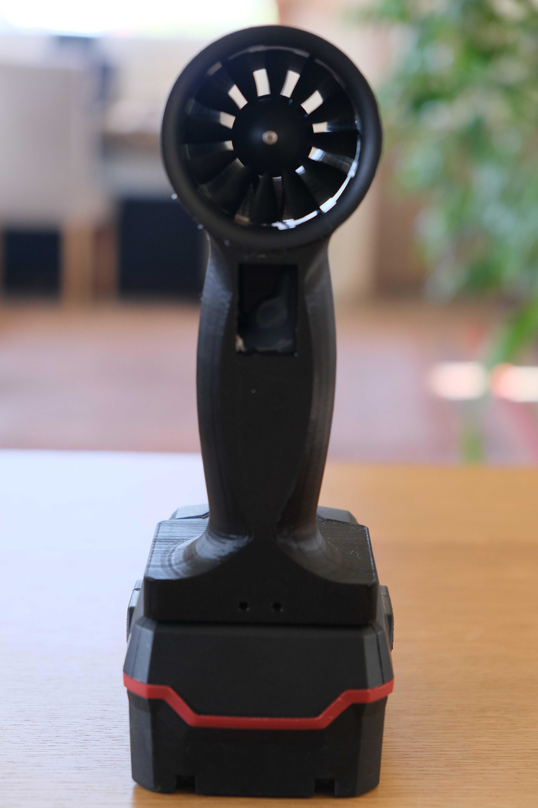
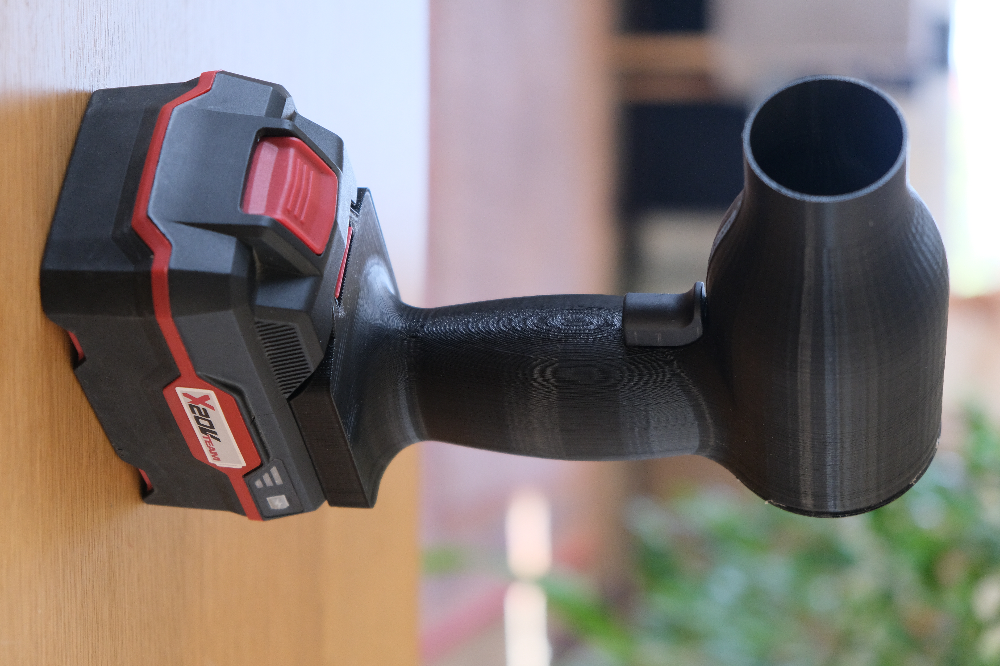

# 3D Printed EDF Handheld Blower

A powerful, cordless handheld blower designed for workshop and DIY cleaning applications. This project utilizes a 50mm Electric Ducted Fan (EDF) powered by Parkside 20V X20V Power tool batteries, with variable speed control via an ATtiny85 microcontroller.

   

## 📁 Project Contents

- **`/firmware`** - Complete PlatformIO project for ATtiny85
- **`/3d_models`** - STL files for 3D printing (main housing prints without supports)
- **`/docs`** - Bill of Materials (BOM), wiring diagrams, and assembly guide
- **`/images`** - Project photos and reference images

## 🛠️ Key Features

- **Powerful Airflow**: 50mm EDF produces significant airflow for its size
- **Variable Speed Control**: ATtiny85 provides PWM control via trigger
- **Battery Compatibility**: Works with affordable Parkside 20V battery ecosystem
- **3D Printable**: Main housing prints in one piece without supports
- **Open Source**: Fully customizable design and firmware

## 📋 Bill of Materials

| Component | Quantity | Notes |
|-----------|----------|-------|
| [50mm EDF Unit](https://www.aliexpress.com/item/1005006375371395.html?spm=a2g0o.order_list.order_list_main.146.75701802Td0HFp) | 1 | Brushless DC motor with fan |
| [45A BLDC ESC](https://www.aliexpress.com/item/4000433679071.html?spm=a2g0o.order_list.order_list_main.56.75701802Td0HFp) | 1 | Electronic Speed Controller |
| [ATtiny85](https://www.microchip.com/en-us/product/attiny85) | 1 | Microcontroller |
| [LM7805 Voltage Regulator](https://eu.mouser.com/ProductDetail/STMicroelectronics/L7805CV?qs=9NrABl3fj%2FqplZAHiYUxWg%3D%3D&utm_id=6470818026&utm_source=google&utm_medium=cpc&utm_marketing_tactic=emeacorp&gad_source=1&gad_campaignid=6470818026&gbraid=0AAAAADn_wf1989EGXnXSTC5yUFqAKvHs2&gclid=CjwKCAiAlfvIBhA6EiwAcErpyV3oJkenb3E_x4Bor8f77w4dtCgcRaL83sYl72GSFM-5JMw3Fl3GTRoC9dsQAvD_BwE) | 1 | 5V regulation |
| [Momentary Switch](https://www.aliexpress.com/item/1005007420837979.html?spm=a2g0o.order_list.order_list_main.136.75701802Td0HFp) | 1 | Trigger |

## 🔧 Assembly

1. **3D Print** the main housing (no supports required)
2. **Install EDF** using silicone sealant or hot glue
3. **Solder electronics** according to wiring diagram
4. **Upload firmware** using Arduino as ISP programmer
5. **Assemble** all components into the housing

## ⚡ Firmware

The ATtiny85 firmware provides:
- ESC control signal generation
- Adjustable pulse timing for throttle configuration

### Programming Requirements:
- PlatformIO (recommended) or Arduino IDE
- Arduino Uno (as ISP programmer)
- ATtiny85 core support

## 🖨️ 3D Printing

- **Filament**: PET-G or PLA recommended
- **Layer Height**: 0.2mm
- **Infill**: 10%
- **Supports**: None required
- **Orientation**: Print as-is

## 🔗 Related Links

- [Instructables Build Guide](https://www.instructables.com/3D-Printable-EDF-Blower-Fan/)
- [Thingiverse 3D Model](https://www.thingiverse.com/thing:7206386)
- [Testing video](https://youtu.be/bUUTJftmKFA)

## 📄 License

This project is licensed under the MIT License - see the LICENSE file for details.

## ⚠️ Safety Note

This device uses high-current batteries and produces significant airflow. Always ensure proper wiring insulation and battery safety. The creator is not responsible for any damage or injury resulting from the use of this project.

---

*Part of the Sprig-Labs open-source hardware solutions.*
